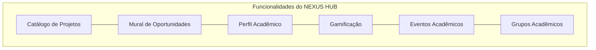
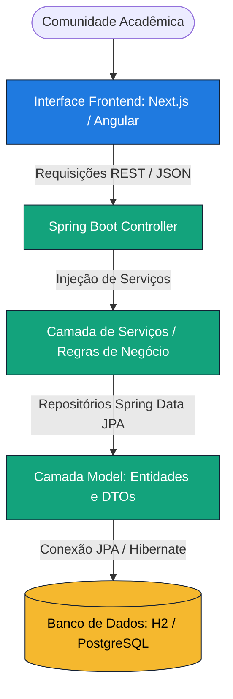

# Apresentação do NEXUS HUB
> **Slogan:** A vida acadêmica em movimento.

O **NEXUS HUB** é uma plataforma acadêmica gamificada criada para centralizar a vida universitária em um único lugar, conectando estudantes, professores, grupos e oportunidades. O sistema transforma a participação em projetos e eventos em reconhecimento tangível (pontos, rankings e conquistas), combatendo a dispersão de informações nos campi.

---

## 🎯 Proposta e Propósito

Nas universidades, as informações sobre projetos de pesquisa, grupos de extensão, bolsas de monitoria, eventos e vagas de estágio costumam ficar extremamente fragmentadas em canais não oficiais — grupos de mensagens (WhatsApp/Telegram), postagens em redes sociais, e-mails institucionais ignorados ou murais físicos. 

O **NEXUS HUB** centraliza esse ecossistema. Ele serve para:
1. **Conectar pontas:** Permitir que estudantes descubram iniciativas e que professores e grupos encontrem talentos.
2. **Promover Engajamento:** Usar dinâmicas saudáveis de gamificação para motivar a participação ativa na comunidade acadêmica.
3. **Gerar Reconhecimento:** Transformar horas de pesquisa, extensão e presença em eventos em conquistas visíveis, construindo um portfólio acadêmico dinâmico e confiável.

---

## 🧱 Problemas Resolvidos

> [!IMPORTANT]
> O NEXUS HUB ataca diretamente a ineficiência de comunicação e a falta de visibilidade nas instituições de ensino.

| Problema Antigo | Solução NEXUS HUB |
| :--- | :--- |
| **Comunicação Fragmentada** | Mural único e centralizado com filtros inteligentes por área de interesse. |
| **Baixa Visibilidade de Projetos** | Portfólio público de laboratórios, pesquisas e projetos de extensão. |
| **Dificuldade para Achar Bolsas/Vagas** | Mural de oportunidades atualizado em tempo real com alertas de prazo. |
| **Desengajamento de Alunos** | Sistema de pontos e rankings que recompensa a proatividade. |
| **Falta de Histórico Unificado** | Perfil acadêmico estruturado que funciona como um "LinkedIn" interno da universidade. |

---

## 👥 Público-Alvo

O sistema foi desenhado para atender a todos os pilares da comunidade acadêmica:

*   **Estudantes:** Buscam construir um currículo forte, encontrar bolsas, monitorias, estágios, e participar de grupos e eventos.
*   **Professores & Orientadores:** Precisam de espaço para divulgar suas pesquisas, recrutar novos integrantes e dar visibilidade às suas iniciativas de extensão.
*   **Coordenações & Gestores:** Querem acompanhar o engajamento da comunidade acadêmica, mapear a produção científica da instituição e divulgar avisos e eventos gerais.
*   **Grupos, Laboratórios & Centros Acadêmicos:** Desejam centralizar seus membros e gerenciar seus projetos conjuntos.

---

## 🌟 Funcionalidades Principais

### 1. 📂 Catálogo de Projetos
Repositório completo de projetos acadêmicos (pesquisa, extensão, iniciação científica) em andamento no campus. Estudantes podem visualizar requisitos e solicitar participação diretamente na plataforma.

### 2. 👥 Páginas de Grupos
Espaço dedicado para que laboratórios, ligas acadêmicas, empresas juniores e centros acadêmicos divulguem seus membros, conquistas e projetos vinculados.

### 3. 💼 Mural de Oportunidades
Vagas de estágio, bolsas de pesquisa, monitorias e trabalhos voluntários. Conta com selo de urgência para prazos próximos.

### 4. 📅 Calendário de Eventos
Centralização de palestras, semanas acadêmicas, congressos e minicursos, permitindo inscrições facilitadas e controle de presença.

### 5. 🏆 Gamificação e Perfil Acadêmico
À medida que o aluno participa de projetos, se inscreve em eventos ou realiza conquistas, ele acumula pontos, desbloqueia badges (medalhas) e sobe de nível. Os estudantes mais ativos aparecem no ranking da instituição.

---

## 💻 Arquitetura Técnica e Tecnologias

O NEXUS HUB adota uma arquitetura modular baseada no padrão **MVC (Model-View-Controller)** de forma explícita, promovendo escalabilidade e desacoplamento de responsabilidades.

*   **Backend (Spring Boot):** Dividido nos módulos Maven `model` (responsável pelo domínio, regras de negócio e persistência) e `controller` (responsável por expor a API REST).
*   **Frontend (Next.js / Angular):** Interfaces rápidas e responsivas focadas na melhor experiência do usuário universitário.
*   **Banco de Dados:** Atualmente configurado com banco em memória H2 para agilidade no desenvolvimento, com suporte nativo para migração em ambiente de produção para PostgreSQL.

---

## 🗺️ Roadmap de Desenvolvimento

O projeto está estruturado em 6 fases de evolução contínua:

1.  **Fase 1: Base MVC (Atual)**
    *   Configuração do esqueleto em Java Spring Boot e interface web.
    *   APIs básicas de projetos, grupos e oportunidades.
2.  **Fase 2: Identidade & Usuários**
    *   Sistema de cadastro e login.
    *   Perfis acadêmicos com áreas de interesse.
3.  **Fase 3: Projetos e Grupos Avançados**
    *   Processo de solicitação de entrada em projetos.
    *   Associação entre laboratórios e seus projetos.
4.  **Fase 4: Motor de Gamificação**
    *   Distribuição automática de pontos por atividades.
    *   Geração de rankings e desbloqueio de badges/medalhas.
5.  **Fase 5: Eventos & Oportunidades**
    *   Inscrição em eventos acadêmicos, controle de presença e mural completo.
6.  **Fase 6: Painel Administrativo**
    *   Dashboard de moderação para coordenadores e relatórios de engajamento do campus.
