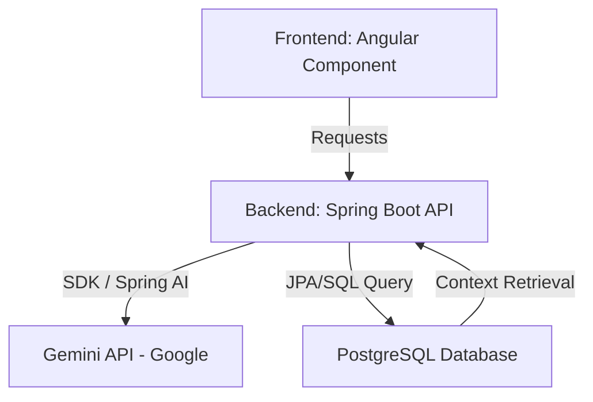

# Plano de Integração de Inteligência Artificial - Nexus Hub

Este documento detalha o planejamento estratégico e técnico para a integração de Inteligência Artificial (IA) no **Nexus Hub**, transformando a experiência acadêmica dos usuários através de assistentes inteligentes, recomendações personalizadas e automações.

---

## 💡 Ideias de Implementação de IA

### 1. 💬 NexusAssist: O Assistente Virtual de Navegação e Suporte
Um chatbot interativo (flutuante) no canto inferior direito da tela que auxilia os estudantes e professores a utilizarem a plataforma e a buscarem informações acadêmicas.

*   **Ajuda de Navegação:** Responder a dúvidas como: *"Como faço para criar um grupo?"* ou *"Onde posso ver as vagas nas quais me candidatei?"*.
*   **Consulta Inteligente (RAG - Retrieval-Augmented Generation):** O bot poderá buscar informações diretamente do banco de dados (através de APIs seguras) para responder a perguntas contextuais:
    *   *"Quais grupos de pesquisa sobre Inteligência Artificial estão ativos?"*
    *   *"Existem vagas de voluntariado abertas no momento?"*
    *   *"Quem é o coordenador do grupo PCC?"*
*   **Ações por Linguagem Natural:** Permitir que o usuário execute ações simples falando com o bot (ex: *"Quero me candidatar à vaga de Desenvolvedor no grupo PCC"*, enviando o comando e redirecionando a página).

### 2. 🎯 Recomendação Inteligente de Vagas e Projetos
Análise do perfil do usuário (habilidades descritas no perfil, área de estudo, histórico de participações) para sugerir novos projetos e oportunidades ideais.

*   **Matchmaking de Habilidades:** Se um estudante tem interesse em "Angular" e "Design UI/UX", o sistema destaca na aba "Início" os grupos e projetos que buscam essas tags.
*   **Notificações Personalizadas:** Envio de alertas inteligentes quando um grupo publica uma vaga que encaixa perfeitamente com o perfil do aluno.

### 3. ✍️ Assistente de Escrita para Coordenadores
Ajuda coordenadores de grupos e projetos a criarem conteúdos mais atraentes para a plataforma.

*   **Gerador de Descrição de Projetos:** O usuário digita alguns tópicos (ex: *"Projeto de extensão de robótica, usa Arduino, voltado para escolas públicas"*) e a IA gera uma descrição estruturada e engajadora.
*   **Otimizador de Vagas:** Sugere melhorias na descrição de requisitos de vagas para torná-las mais claras para os estudantes.

---

## 🛠️ Arquitetura Técnica Proposta

Para garantir eficiência, custos baixos (ou nulos) e segurança dos dados, propomos a seguinte pilha técnica:

### Detalhes Tecnológicos:
1.  **Modelo de Linguagem (LLM):** **Gemini 2.5 Flash** (via Google AI Studio). Ele possui um limite gratuito generoso, excelente velocidade de resposta e capacidades avançadas de compreensão em português.
2.  **Camada de Integração (Backend):** Utilizar o framework **Spring AI** no módulo `controller` para gerenciar as chamadas e o histórico de mensagens, ou integrar via HTTP Client direto com a API oficial do Gemini.
3.  **Segurança e Limitação de Uso (Rate Limiting):** As chaves de API da IA ficam protegidas no Backend. Implementaremos limites de requisição por usuário logado para evitar abusos na API.
4.  **Interface de Usuário (UI):** Um componente Angular moderno, responsivo, integrado ao tema escuro/claro do Nexus Hub, com micro-animações de "digitando..." para simular conversa natural.

---

## 📅 Etapas de Implementação

Se aprovado, o desenvolvimento pode ser divisão nas seguintes fases:

### Fase 1: Setup e Endpoint de Chat Simples 🟢
*   Criação de conta no Google AI Studio e geração da API Key.
*   Criação do serviço de IA no Backend (Spring Boot) consumindo o Gemini.
*   Desenvolvimento do componente de Chat no Frontend (design flutuante básico).

### Fase 2: Contextualização e RAG (Dados Locais) 🟡
*   Permitir que a IA conheça as regras da plataforma (FAQ do Nexus Hub).
*   Integrar as APIs de busca de Grupos, Projetos e Vagas ao prompt da IA (através de *Function Calling* ou injeção de contexto), permitindo que ela responda sobre dados reais do banco.

### Fase 3: Personalização e Recomendações 🔴
*   Implementação do algoritmo de matchmaking no painel principal do usuário.
*   Otimizações de segurança e implementação do Rate Limiting.

---

> [!NOTE]
> Este plano prioriza uma integração nativa e segura, onde os dados do banco de dados não são enviados indiscriminadamente para a IA, mantendo o controle total da privacidade dos dados dos estudantes da UFPB.
